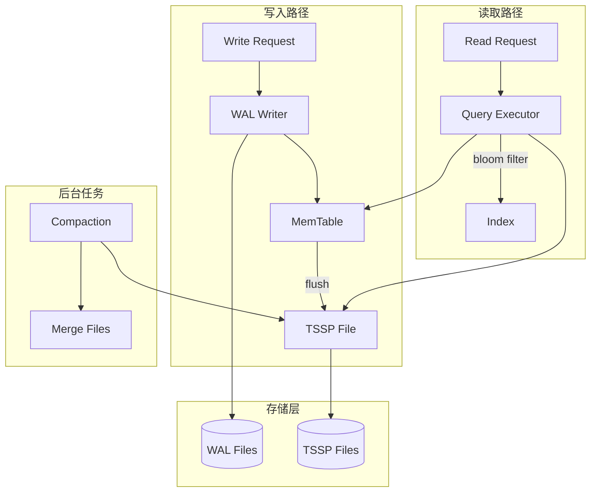

# 架构设计

## 系统概述

openGemini-rs 是一个专注于时序数据的存储引擎，采用 LSM-tree 结构实现高性能写入和高效压缩存储。系统设计遵循模块化原则，便于独立使用或集成到更大的时序数据库系统中。

## 技术栈

| 组件 | 技术选择 | 说明 |
|------|----------|------|
| 语言 | Rust | 内存安全、高性能 |
| 异步运行时 | Tokio | 异步 I/O 支持 |
| 压缩 | snappy/zstd/lz4 | 可插拔压缩算法 |
| 索引 | Roaring Bitmap | 高效位图索引 |
| 错误处理 | thiserror/anyhow | 友好的错误处理 |

## 项目结构

```
openGemini-rs/
├── Cargo.toml              # Workspace 配置
├── crates/
│   └── engine/             # 核心存储引擎
│       ├── Cargo.toml
│       └── src/
│           ├── lib.rs
│           ├── config.rs   # 配置定义
│           ├── wal/         # 预写日志
│           ├── memtable/   # 内存表
│           ├── tssp/       # TSSP 文件格式
│           ├── compaction/ # 压缩合并
│           └── index/      # 索引管理
├── README.md
└── LICENSE
```

## 核心模块

### 1. Config 模块
- **职责**: 存储引擎配置管理
- **功能**: 加载/验证配置参数

### 2. WAL 模块 (Write-Ahead Log)
- **职责**: 保证数据持久性
- **功能**:
  - 顺序写入日志
  -崩溃恢复
  - 日志清理

### 3. MemTable 模块
- **职责**: 内存数据缓冲
- **功能**:
  - 有序写入
  - 内存索引
  - 刷盘触发

### 4. TSSP 模块
- **职责**: 列式文件存储
- **功能**:
  - 文件读写
  - 列式压缩
  - 块级索引

### 5. Compaction 模块
- **职责**: 文件合并优化
- **功能**:
  - 小文件合并
  - 过期数据清理
  - 存储空间回收

### 6. Index 模块
- **职责**: 时序索引管理
- **功能**:
  - Roaring Bitmap 索引
  - 时间线索引
  - 标签索引

## 架构图



## 关键流程

### 写入流程

1. 接收写入请求
2. 写入 WAL（保证持久性）
3. 写入 MemTable（内存缓冲）
4. 当 MemTable 达到阈值，触发刷盘
5. 生成 TSSP 文件

### 读取流程

1. 接收查询请求
2. 解析时间范围和过滤条件
3. 使用 Bloom Filter 过滤不必要的 TSSP 文件
4. 使用 Index 定位数据块
5. 并行读取并解压数据
6. 聚合返回结果

### 压缩合并流程

1. 定期检查需要合并的 TSSP 文件
2. 按照时间线顺序读取多个小文件
3. 合并排序后写入新文件
4. 删除原小文件
5. 更新元数据

## 设计决策

### 1. 为什么使用 LSM-tree？
- 写入性能优于 B-tree
- 天然支持顺序写入
- 适合时序数据的追加模式

### 2. 为什么使用列式存储？
- 压缩效率高（同类型数据连续存储）
- 只读取需要的列
- 向量化查询加速

### 3. 为什么使用 Monorepo 结构？
- 便于代码共享
- 统一版本管理
- 方便后续添加 ts-sql、ts-meta 等组件

### 4. 压缩算法选择
- 默认使用 snappy（平衡速度和压缩比）
- 冷数据可选 zstd（更高压缩比）
- 支持 lz4（极快速度）