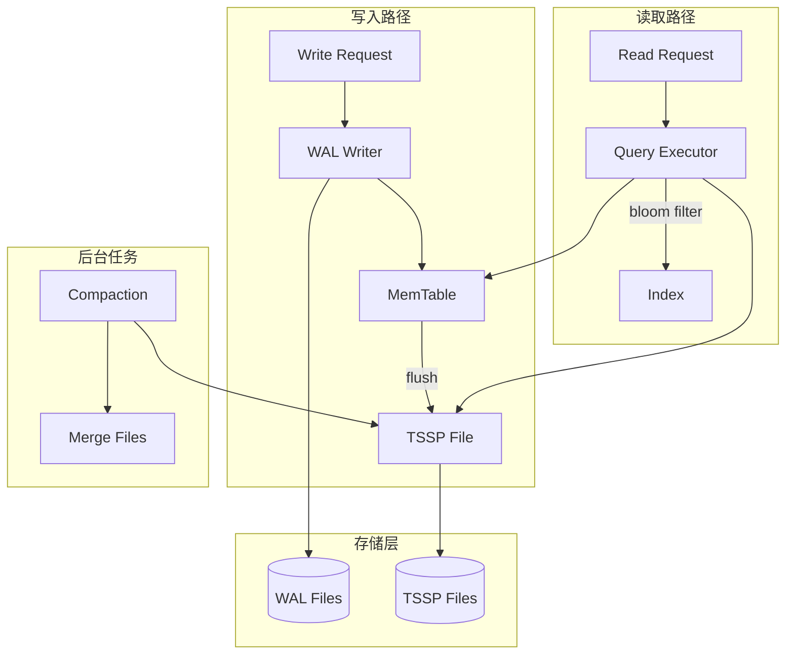

# 架构设计

## 系统概述

openGemini-rs 是一个专注于时序数据的存储引擎，采用 LSM-tree 结构实现高性能写入和高效压缩存储。系统设计遵循模块化原则，便于独立使用或集成到更大的时序数据库系统中。

本架构遵循原始 openGemini Go 版本的设计模式，参考 [openGemini 架构](https://deepwiki.com/openGemini/openGemini/1.1-architecture)。

## 技术栈

| 组件 | 技术选择 | 说明 |
|------|----------|------|
| 语言 | Rust | 内存安全、高性能 |
| 异步运行时 | Tokio | 异步 I/O 支持 |
| 压缩 | snappy/zstd/lz4 | 可插拔压缩算法 |
| 索引 | Roaring Bitmap | 高效位图索引 |
| 错误处理 | thiserror/anyhow | 友好的错误处理 |

## 项目结构

```
openGemini-rs/
├── Cargo.toml              # Workspace 配置
├── crates/
│   └── engine/             # 核心存储引擎
│       ├── Cargo.toml
│       └── src/
│           ├── lib.rs
│           ├── config.rs   # 配置定义
│           ├── wal/         # 预写日志
│           ├── memtable/   # 内存表
│           ├── tssp/       # TSSP 文件格式
│           ├── compaction/ # 压缩合并
│           ├── index/      # 索引管理
│           ├── bloom/      # Bloom Filter
│           ├── block_index/ # 块级索引
│           └── ttl/        # TTL 管理
├── README.md
└── LICENSE
```

## Agent 实现架构约束

本节定义 openGemini-rs 实现过程中必须遵循的架构约束，确保 Rust 版本与原始 Go 版本保持架构一致性和功能等价性。

### 1. 存储引擎约束

#### 1.1 LSM-tree 结构
- **必须实现**: MemTable (mutable) → TSSP Files (immutable) 的 LSM 结构
- **约束**: 所有写入必须先写入 WAL，再写入 MemTable
- **约束**: MemTable 达到阈值时必须触发 flush 生成 TSSP 文件
- **约束**: TSSP 文件一旦生成则不可修改（immutable）

#### 1.2 分层存储 (Tiered Storage)
| 层级 | 介质 | 用途 | 约束 |
|------|------|------|------|
| Hot | Memory | 最新写入数据 | 内存限制由 `nodeMutableLimit` 控制 |
| Warm | Local SSD/HDD | 较早数据 | 介于 Hot 和 Cold 之间 |
| Cold | Cloud Storage (S3/Azure/GCS) | 历史归档数据 | 需支持冷热数据迁移 |

#### 1.3 Shard 管理
- **约束**: 数据按 Shard 分区，每个 Shard 独立管理自己的 MemTable、WAL 和 TSSP 文件
- **约束**: Shard ID 由 Meta 节点分配
- **约束**: Shard 映射由 ShardMapper 处理

### 2. TSSP 文件格式约束

#### 2.1 列式存储
- **约束**: TSSP 采用列式存储，Tags 和 Fields 分别序列化
- **约束**: 同一列的数据连续存储以提高压缩比
- **目标**: 压缩比 >= 15:1

#### 2.2 文件结构
```
TSSP File Structure:
├── Header (Magic, Version, Schema)
├── Bloom Filter (Series Filter)
├── Block Index (Time Range → Data Block)
├── Column Data (Tag Block, Field Block 1...N)
└── Footer (CRC, Statistics)
```

#### 2.3 必需组件
| 组件 | 用途 | 约束 |
|------|------|------|
| Bloom Filter | 快速判断 Series 是否存在 | 必需 |
| Block Index | 时间范围到数据块的映射 | 必需 |
| Columnar Data | 列式存储的 Tags/Fields | 必需 |
| CRC Checksum | 数据完整性校验 | 必需 |

### 3. WAL 约束

#### 3.1 持久性保证
- **约束**: 写入必须先持久化到 WAL 才能返回成功
- **约束**: WAL 支持崩溃后 replay 恢复数据
- **约束**: WAL 目录结构支持多分区并行写入 (partition_N/)

#### 3.2 配置参数
| 参数 | 默认值 | 说明 |
|------|--------|------|
| wal_path | wal/ | WAL 根目录 |
| partition_num | 16 | 最大分区数 |
| wal_sync_interval | 0 | 同步间隔 (ms) |
| wal_replay_async | true | replay 模式 |

### 4. 索引约束

#### 4.1 Series Index
- **约束**: 使用 Roaring Bitmap 存储 Series ID 集合
- **约束**: 支持按 Series ID 高效过滤
- **约束**: 索引数据存储在内存中

#### 4.2 Block Index
- **约束**: 每个 TSSP 文件包含 Block Index
- **约束**: Block Index 记录每个数据块的时间范围和位置
- **约束**: 支持快速定位满足时间范围查询的数据块

### 5. 后台任务约束

#### 5.1 Compaction
- **约束**: 合并小 TSSP 文件为更大的文件
- **约束**: 触发条件: 文件数 >= 3 或 时间触发
- **约束**: compaction 不能阻塞正常读写

#### 5.2 Snapshot/Flush
| 触发条件 | 说明 |
|----------|------|
| 时间触发 | `writeColdDuration` 秒无写入 |
| 强制触发 | `forceSnapShotDuration` 最大时间 |
| 大小触发 | MemTable 超过配置限制 |
| 手动触发 | `ForceFlush()` API |

#### 5.3 Retention
- **约束**: 根据 TTL 删除过期数据
- **约束**: 定期检查过期数据

### 6. 查询处理约束

#### 6.1 查询流程
```
Query Request → Filter Optimization → Index Scan → TSSP Read → Result Merge
```

#### 6.2 过滤表达式
| 表达式 | 说明 | 约束 |
|--------|------|------|
| Eq | 等于 | 必须支持 |
| Ne | 不等于 | 必须支持 |
| Gt | 大于 | 必须支持 |
| Gte | 大于等于 | 必须支持 |
| Lt | 小于 | 必须支持 |
| Lte | 小于等于 | 必须支持 |
| And | 逻辑与 | 必须支持 |
| Or | 逻辑或 | 必须支持 |

#### 6.3 查询优化
- **约束**: 使用 Bloom Filter 跳过不包含目标 Series 的文件
- **约束**: 使用 Block Index 跳过不满足时间范围的数据块
- **约束**: 支持 LIMIT 限制返回行数

### 7. 内存管理约束

#### 7.1 Memory Bucket
- **约束**: 使用 token bucket 控制全局内存使用
- **约束**: 写入前必须获取内存 token
- **约束**: snapshot 释放内存 token

#### 7.2 内存监控
- **约束**: 监控系统的 total/available memory
- **约束**: 缓存内存统计信息 (1秒间隔)

### 8. 文件组织约束

```
<dataPath>/
├── <database>/
│   ├── <retentionPolicy>/
│   │   ├── <shardId>/
│   │   │   ├── <measurement>/
│   │   │   │   ├── <sequenceNumber>.<merge>.<extent>.tssp  # Order file
│   │   │   │   ├── <sequenceNumber>.<merge>.<extent>.tssp.init  # Unorder file
│   │   │   │   └── ...
│   │   │   └── wal/
│   │   │       ├── partition_0/
│   │   │       ├── partition_1/
│   │   │       └── ...
│   │   └── index/
│   │       └── ...
```

### 9. 配置约束

#### 9.1 必需配置项
| 配置项 | 类型 | 默认值 | 说明 |
|--------|------|--------|------|
| data_dir | PathBuf | data/ | 数据根目录 |
| wal.dir | PathBuf | wal/ | WAL 目录 |
| wal.file_size | u64 | 64MB | WAL 文件大小 |
| wal.sync_enabled | bool | true | 是否同步写入 |
| memtable.max_size | u64 | 64MB | MemTable 最大大小 |
| memtable.flush_interval_ms | u64 | 1000 | 刷盘间隔 |
| tssp.max_file_size | u64 | 256MB | TSSP 文件最大大小 |
| tssp.compression | CompressionType | Snappy | 压缩算法 |
| compaction.enabled | bool | true | 是否启用压缩 |
| compaction.max_concurrent | usize | 4 | 最大并发压缩数 |
| compaction.trigger_interval_ms | u64 | 300000 | 压缩触发间隔 |
| compaction.max_file_age_hours | u64 | 24 | 文件最大存活时间 |

### 10. 错误处理约束

#### 10.1 错误类型
| 错误类型 | 说明 |
|----------|------|
| EngineError::WriteError | 写入失败 |
| EngineError::ReadError | 读取失败 |
| EngineError::NotFound | 数据不存在 |
| EngineError::CompactionError | 压缩失败 |
| EngineError::MemoryLimitExceeded | 内存超限 |
| EngineError::Corruption | 数据损坏 |

#### 10.2 约束
- **约束**: 所有公开 API 必须返回 Result 类型
- **约束**: 使用 thiserror 定义错误类型
- **约束**: 错误信息应包含上下文信息

## 核心模块

### 1. Config 模块
- **职责**: 存储引擎配置管理
- **功能**: 加载/验证配置参数

### 2. WAL 模块 (Write-Ahead Log)
- **职责**: 保证数据持久性
- **功能**:
  - 顺序写入日志
  - 崩溃恢复
  - 日志清理

### 3. MemTable 模块
- **职责**: 内存数据缓冲
- **功能**:
  - 有序写入
  - 内存索引
  - 刷盘触发

### 4. TSSP 模块
- **职责**: 列式文件存储
- **功能**:
  - 文件读写
  - 列式压缩
  - 块级索引

### 5. Compaction 模块
- **职责**: 文件合并优化
- **功能**:
  - 小文件合并
  - 过期数据清理
  - 存储空间回收

### 6. Index 模块
- **职责**: 时序索引管理
- **功能**:
  - Roaring Bitmap 索引
  - 时间线索引
  - 标签索引

## 架构图



## 关键流程

### 写入流程

1. 接收写入请求
2. 写入 WAL（保证持久性）
3. 写入 MemTable（内存缓冲）
4. 当 MemTable 达到阈值，触发刷盘
5. 生成 TSSP 文件

### 读取流程

1. 接收查询请求
2. 解析时间范围和过滤条件
3. 使用 Bloom Filter 过滤不必要的 TSSP 文件
4. 使用 Index 定位数据块
5. 并行读取并解压数据
6. 聚合返回结果

### 压缩合并流程

1. 定期检查需要合并的 TSSP 文件
2. 按照时间线顺序读取多个小文件
3. 合并排序后写入新文件
4. 删除原小文件
5. 更新元数据

## 设计决策

### 1. 为什么使用 LSM-tree？
- 写入性能优于 B-tree
- 天然支持顺序写入
- 适合时序数据的追加模式

### 2. 为什么使用列式存储？
- 压缩效率高（同类型数据连续存储）
- 只读取需要的列
- 向量化查询加速

### 3. 为什么使用 Monorepo 结构？
- 便于代码共享
- 统一版本管理
- 方便后续添加 ts-sql、ts-meta 等组件

### 4. 压缩算法选择
- 默认使用 snappy（平衡速度和压缩比）
- 冷数据可选 zstd（更高压缩比）
- 支持 lz4（极快速度）